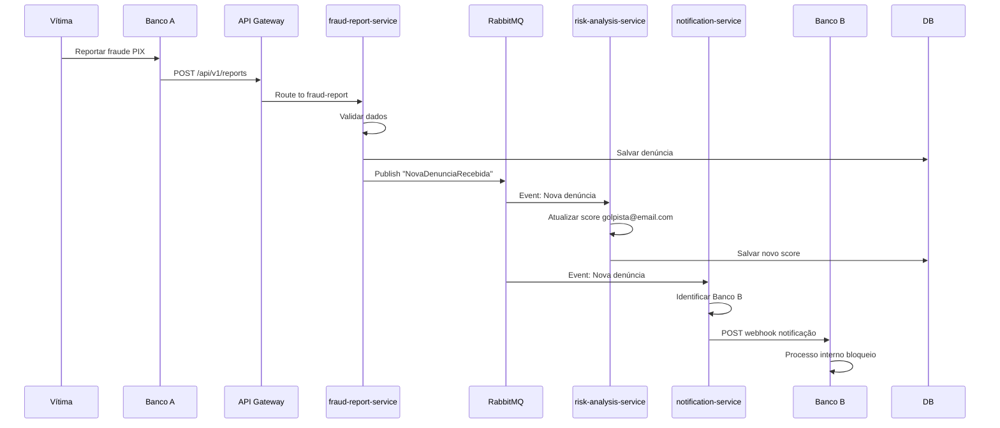

# 🛡️ Sentinela PIX - Plataforma de Mitigação de Golpes PIX

## 📖 Visão Geral

**Sentinela PIX** é uma plataforma centralizada de alerta e análise de fraudes em tempo real, projetada para combater golpes PIX no Brasil através de notificação ultrarrápida entre instituições financeiras e análise de risco baseada em denúncias.

### 🎯 Problema

A maior vulnerabilidade no golpe do PIX é o **tempo**. O dinheiro é transferido quase instantaneamente, tornando o bloqueio e a recuperação muito difíceis. O sistema bancário atual não tem um mecanismo centralizado para comunicar fraudes rapidamente entre diferentes instituições.

### 💡 Solução

A plataforma **Sentinela PIX** não tenta reverter transações PIX (complexo e dependente das instituições), mas sim:

- ⚡ **Agilizar Notificação**: Criar um canal ultrarrápido para que a instituição financeira da vítima comunique a instituição do golpista
- 📊 **Score de Risco**: Analisar e sinalizar chaves PIX e contas que recebem múltiplas denúncias de golpe
- 🛡️ **Prevenção**: Ajudar a prevenir futuras transações para contas fraudulentas

## 🚀 Demonstração

O projeto está totalmente funcional e pode ser executado localmente:

- **🖥️ Dashboard Web**: http://localhost:8080
- **🔧 API Backend**: http://localhost:3001/api/v1
- **❤️ Health Check**: http://localhost:3001/health

### Screenshots

<details>
<summary>🖼️ Ver Capturas de Tela</summary>

- Dashboard principal com KPIs em tempo real
- Sistema de denúncias interativo
- Análise de risco por chave PIX
- Gráficos e relatórios detalhados

</details>

---

## 🎭 Atores do Sistema

| Ator | Descrição | Responsabilidade |
|------|-----------|-----------------|
| **👤 Usuário Vítima** | Pessoa que foi vítima de golpe PIX | Inicia o processo de denúncia através do app de seu banco |
| **🏦 Instituição Financeira A** | Banco da Vítima | Consome a API do Sentinela PIX para registrar a denúncia de golpe |
| **🔒 Plataforma Sentinela PIX** | Nossa Solução | O cérebro da operação: recebe, processa, armazena e distribui as informações de fraude |
| **🏛️ Instituição Financeira B** | Banco do Golpista | É notificada pela plataforma para tomar ações de bloqueio preventivo na conta suspeita |

---

## 🏗️ Arquitetura de Microsserviços

### Visão Arquitetural

```
┌─────────────────┐    ┌─────────────────────┐    ┌──────────────────────┐
│   App Bancário  │───▶│   API Gateway       │───▶│    Load Balancer     │
│   (Banco A)     │    │ (Spring Cloud GW)   │    │                      │
└─────────────────┘    └─────────────────────┘    └──────────────────────┘
                                  │
                ┌─────────────────┼─────────────────┐
                │                 │                 │
                ▼                 ▼                 ▼
    ┌───────────────────┐ ┌─────────────────┐ ┌─────────────────┐
    │ fraud-report-     │ │ risk-analysis-  │ │ notification-   │
    │ service           │ │ service         │ │ service         │
    │                   │ │                 │ │                 │
    │ • Recebe denúncias│ │ • Score de risco│ │ • Notifica bancos│
    │ • Valida dados    │ │ • 1→suspeita    │ │ • Webhooks       │
    │ • Persiste no BD  │ │ • 3→alto risco  │ │ • REST API       │
    │ • Publica eventos │ │ • Consulta keys │ │ • Auto notif.    │
    └───────────────────┘ └─────────────────┘ └─────────────────┘
                │                 │                 │
                └────────────────▼─────────────────┘
                        ┌─────────────────┐
                        │   RabbitMQ      │
                        │   (Mensageria)  │
                        │                 │
                        │ • NovaDenuncia  │
                        │ • Async Events  │
                        │ • Pub/Sub       │
                        └─────────────────┘
                                │
                        ┌─────────────────┐
                        │   PostgreSQL    │
                        │   (Database)    │
                        │                 │
                        │ • Denúncias     │
                        │ • Scores PIX    │
                        │ • Históricos    │
                        └─────────────────┘
```

### 🔧 Microsserviços Detalhados

#### 1️⃣ **api-gateway** (Gateway de API)
- **Tecnologia**: Spring Boot + Spring Cloud Gateway
- **Porta**: 8080
- **Responsabilidade**: 
  - Ponto de entrada único para todas as requisições externas dos bancos
  - Autenticação e autorização de APIs
  - Roteamento inteligente para microsserviços
  - Rate limiting e circuit breaker

**Endpoints Principais:**
```
POST /api/v1/reports          → fraud-report-service
GET  /api/v1/keys/{key}/risk  → risk-analysis-service
POST /api/v1/notifications    → notification-service
```

#### 2️⃣ **fraud-report-service** (Serviço de Denúncias)
- **Tecnologia**: Java 17+, Spring Boot, JPA/Hibernate
- **Porta**: 8081
- **Responsabilidade**:
  - Receber detalhes da denúncia (chave PIX do golpista, valor, horário, ID da transação)
  - Validar dados de entrada
  - Persistir denúncias no PostgreSQL
  - Publicar evento "NovaDenunciaRecebida" para RabbitMQ

**Modelo de Dados:**
```java
@Entity
public class FraudReport {
    private Long id;
    private String pixKey;           // Chave PIX do golpista
    private BigDecimal amount;       // Valor da transação
    private LocalDateTime timestamp; // Horário da transação
    private String transactionId;    // ID da transação PIX
    private String victimBank;       // Banco da vítima
    private String reporterInfo;     // Dados do denunciante
    private FraudStatus status;      // PENDING, CONFIRMED, FALSE_POSITIVE
}
```

#### 3️⃣ **risk-analysis-service** (Serviço de Análise de Risco)
- **Tecnologia**: Java 17+, Spring Boot
- **Porta**: 8082  
- **Responsabilidade**:
  - Escutar eventos de novas denúncias
  - Manter registro de chaves PIX e contas denunciadas
  - Calcular score de risco automático
  - Expor endpoint de consulta de risco

**Lógica de Score:**
- 📊 **1 denúncia** = Chave marcada como "suspeita"
- 🚨 **3 denúncias em 24h** = Chave marcada como "alto risco"
- 🔍 **Histórico** = Análise de padrões comportamentais

**Endpoint de Consulta:**
```
GET /api/v1/keys/{chavePix}/risk
Response: {
  "pixKey": "golpista@email.com",
  "riskLevel": "HIGH_RISK",
  "reportCount": 5,
  "firstReportDate": "2024-10-15T14:30:00Z",
  "lastReportDate": "2024-10-17T09:15:00Z"
}
```

#### 4️⃣ **notification-service** (Serviço de Notificações)  
- **Tecnologia**: Java 17+, Spring Boot
- **Porta**: 8083
- **Responsabilidade**:
  - Escutar eventos de "NovaDenunciaRecebida"
  - Identificar instituição financeira do golpista
  - Enviar notificação automática via webhook/REST API
  - Retry logic para garantia de entrega

**Fluxo de Notificação:**
1. Evento recebido do RabbitMQ
2. Identificação do banco pela chave PIX
3. Lookup de webhook da instituição
4. Envio da notificação com retry automático
5. Log de auditoria da entrega

---

## 🌊 Fluxo Operacional Completo

### 📱 Cenário: Denúncia de Golpe PIX

**1. 🎣 O Golpe Acontece**
```
Vítima → PIX R$ 5.000 → golpista@email.com (Banco B)
```

**2. 🚨 Denúncia Imediata**
```
Vítima → App Banco A → "Reportar Fraude PIX"
```

**3. 🔄 Processamento Sentinela PIX**



**4. ⚡ Ação do Banco B**
- Sistema recebe notificação automática
- Processo interno de bloqueio preventivo disparado
- Conta do golpista pode ser congelada
- Impedimento de saque/transferência do dinheiro

---

## 🛠️ Stack Tecnológica

### Backend
- **☕ Java 17 LTS** - Linguagem principal
- **🍃 Spring Boot 3.1** - Framework de aplicação
- **🌐 Spring Cloud Gateway** - API Gateway
- **🔄 Spring AMQP** - Integração RabbitMQ
- **🗄️ Spring Data JPA** - Persistência de dados
- **🔒 Spring Security** - Autenticação e autorização

### Infraestrutura
- **🐳 Docker** - Containerização
- **🐰 RabbitMQ** - Sistema de mensageria
- **🐘 PostgreSQL** - Banco de dados principal
- **📦 Redis** - Cache distribuído
- **☁️ Azure** - Plataforma de nuvem

### Qualidade & Testes
- **🧪 JUnit 5** - Testes unitários
- **🎭 Mockito** - Mocking para testes
- **🔍 SonarQube** - Análise de código
- **📊 Actuator** - Monitoramento e métricas

---

## 🔧 Pré-requisitos

### Desenvolvimento Local
- Java 17 LTS
- Docker Desktop
- Maven 3.8+
- PostgreSQL (ou via Docker)
- Python 3.x ou Node.js (para frontend)

---

## 🚀 Execução Local

### 📊 Dashboard Frontend (Demo Rápido)

```powershell
# Iniciar frontend dashboard
cd frontend
python -m http.server 8080
# Acesse: http://localhost:8080
```

### 🏗️ Setup Completo do Sistema

```powershell
# 1. Setup completo (infraestrutura + backend)
.\scripts\setup-local.ps1

# 2. Testar APIs
.\scripts\test-api.ps1

# 3. Iniciar frontend  
.\scripts\start-frontend.ps1
```

### 🔧 Execução Manual dos Serviços

```bash
# 1. Infraestrutura
docker-compose up -d postgres redis rabbitmq

# 2. API Gateway
cd microservices/api-gateway
mvn spring-boot:run

# 3. Executar microsserviços (terminais separados)
cd microservices/fraud-report-service
mvn spring-boot:run

cd microservices/risk-analysis-service  
mvn spring-boot:run

cd microservices/notification-service
mvn spring-boot:run

# 4. Frontend
cd frontend
python -m http.server 8080
```

### 📱 URLs dos Serviços

- **Dashboard**: <http://localhost:8080>
- **API Gateway**: <http://localhost:8080/api>
- **Fraud Report Service**: <http://localhost:8081>
- **Risk Analysis Service**: <http://localhost:8082>
- **Notification Service**: <http://localhost:8083>
- **Swagger UI**: <http://localhost:8080/swagger-ui.html>

---

## 🧪 Testes

### Testes Unitários
```bash
# Executar todos os testes
mvn test

# Executar testes com coverage
mvn test jacoco:report

# Testes específicos por serviço
cd microservices/fraud-report-service
mvn test
```

### Testes de Integração
```bash
# Testes end-to-end
.\scripts\test-integration.ps1

# Teste de carga
.\scripts\test-load.ps1
```

---

## 📊 Monitoramento e Observabilidade

### Métricas Disponíveis
- **📈 Throughput**: Requisições por segundo
- **⏱️ Latência**: Tempo de resposta médio
- **🚨 Taxa de Erro**: Percentual de falhas
- **💾 Uso de Recursos**: CPU, Memória, Rede

### Dashboards
- **Grafana**: Visualização de métricas
- **Prometheus**: Coleta de métricas
- **ELK Stack**: Logs centralizados
- **Jaeger**: Tracing distribuído

---

## ☁️ Deploy em Azure

### Recursos Azure Utilizados
- **🎯 Azure Kubernetes Service (AKS)** - Orquestração de containers
- **📦 Azure Container Registry (ACR)** - Registry de imagens Docker
- **🗄️ Azure Database for PostgreSQL** - Banco de dados gerenciado
- **🚀 Azure Service Bus** - Mensageria (alternativa ao RabbitMQ)
- **📊 Azure Monitor** - Observabilidade e alertas

### Pipeline CI/CD
```yaml
# .github/workflows/azure-deploy.yml
name: Deploy to Azure
on:
  push:
    branches: [main]
jobs:
  deploy:
    runs-on: ubuntu-latest
    steps:
      - uses: actions/checkout@v3
      - name: Build and Push to ACR
      - name: Deploy to AKS
      - name: Run Integration Tests
```

---

## 📁 Estrutura do Projeto

```
sentinela-pix/
├── 📄 README.md                    # Documentação principal
├── 📄 EXECUTIVE_SUMMARY.md         # Resumo executivo
├── 📄 IMPLEMENTATION_GUIDE.md      # Guia de implementação
├── 🐳 docker-compose.yml           # Orquestração de containers
├── 📂 microservices/              # Microsserviços backend
│   ├── api-gateway/               # Spring Cloud Gateway
│   ├── fraud-report-service/      # Serviço de denúncias
│   ├── risk-analysis-service/     # Serviço de análise de risco
│   └── notification-service/      # Serviço de notificações
├── 📂 frontend/                   # Dashboard web
│   ├── index.html                # Interface principal
│   ├── dashboard.js              # Lógica JavaScript
│   ├── styles.css                # Estilos customizados
│   └── README.md                 # Documentação frontend
├── 📂 scripts/                   # Scripts de automação
│   ├── setup-local.ps1          # Setup completo
│   ├── test-api.ps1             # Teste das APIs
│   ├── test-integration.ps1     # Testes de integração
│   └── deploy-azure.ps1         # Deploy para Azure
└── 📂 docs/                     # Documentação adicional
    ├── api-spec.yaml            # OpenAPI Specification
    ├── architecture.md          # Detalhes arquiteturais
    └── deployment.md            # Guia de deploy
```

---

## 🎯 Requisitos Atendidos

| Requisito/Diferencial | Implementação na Solução Sentinela PIX |
|----------------------|----------------------------------------|
| **🔧 Desenvolvimento de Aplicações** | 4 microsserviços distintos e funcionais |
| **🧠 Lógica de Programação** | Regras de negócio no risk-analysis-service e validações no fraud-report-service |
| **☕ Linguagem Java** | Todos os microsserviços em Java 17+ |
| **🌐 REST API** | Cada microsserviço expõe APIs REST (POST /reports, GET /keys/{key}/risk) |
| **🗄️ Conexão a Banco de Dados** | PostgreSQL com Spring Data JPA |
| **🍃 Uso de Spring Boot** | Base de toda arquitetura, simplificando configuração e criação das APIs |
| **🏗️ Arquitetura de Microsserviços** | Solução nativamente desenhada com essa arquitetura |
| **🐳 Containers Docker** | Cada microsserviço empacotado em imagem Docker |
| **☁️ Integração em Cloud Azure** | Deploy via Azure Container Registry (ACR) e Azure Kubernetes Service (AKS) |
| **📚 Controle de Versionamento** | Projeto hospedado no GitHub com monorepo |
| **🧪 Testes Unitários** | JUnit 5 e Mockito para testes de Serviços e Controladores |

---

## 🔮 Roadmap Futuro

### Fase 1: MVP (Atual)
- ✅ Microsserviços base
- ✅ APIs REST funcionais
- ✅ Dashboard de monitoramento
- ✅ Documentação completa

### Fase 2: Melhorias
- 🔄 Machine Learning para detecção de padrões
- 📱 App mobile para denúncias
- 🔔 Notificações push em tempo real
- 🌐 API pública para terceiros

### Fase 3: Escala
- 🚀 Deploy multi-região
- 📊 Analytics avançados
- 🔒 Blockchain para auditoria
- 🤖 IA para prevenção proativa

---

## � Como Executar o Projeto

### 🎯 Execução Rápida (Demo Funcional)

O projeto possui uma versão completa funcional com backend Node.js e frontend responsivo:

```powershell
# 1. Clone o repositório
git clone https://github.com/MatheusGino71/A3-sistemas.git
cd A3-sistemas

# 2. Instalar dependências do backend
cd backend
npm install

# 3. Iniciar backend (Terminal 1)
npm start
# ✅ Backend rodando em http://localhost:3001

# 4. Iniciar frontend (Terminal 2)
cd ../frontend
python -m http.server 8080
# ✅ Dashboard disponível em http://localhost:8080
```

### 🌟 Funcionalidades Disponíveis

- **📊 Dashboard Interativo**: KPIs em tempo real, gráficos dinâmicos
- **🚨 Sistema de Denúncias**: Criar, visualizar e gerenciar denúncias
- **📈 Análise de Risco**: Score automático baseado em denúncias
- **🔔 Notificações**: Sistema de alertas para instituições
- **📱 Interface Responsiva**: Funciona em desktop e mobile

### 🛠️ Stack Técnica da Demo

- **Frontend**: HTML5, CSS3, JavaScript (Vanilla), Tailwind CSS
- **Backend**: Node.js, Express.js, CORS
- **API**: RESTful com dados mock para demonstração
- **Funcional**: Totalmente operacional sem dependências externas

---

## �👥 Equipe de Desenvolvimento

- **Arquiteto de Soluções**: Design da arquitetura de microsserviços
- **Desenvolvedor Backend**: Implementação Java/Spring Boot
- **Desenvolvedor Frontend**: Dashboard e interfaces
- **DevOps Engineer**: Docker, Azure, CI/CD
- **QA Engineer**: Testes automatizados e qualidade

---

## 📚 Referências e Estudos

- [Regulamento PIX - Banco Central](https://www.bcb.gov.br/estabilidadefinanceira/pix)
- [Spring Boot Documentation](https://docs.spring.io/spring-boot/docs/current/reference/html/)
- [Azure Kubernetes Service](https://docs.microsoft.com/en-us/azure/aks/)
- [Microservices Patterns](https://microservices.io/patterns/)
- [Fraud Detection Best Practices](https://www.feedzai.com/fraud-detection-guide/)

---

**Projeto Sentinela PIX** - Combatendo fraudes PIX através de tecnologia e colaboração entre instituições financeiras.

*Desenvolvido como solução acadêmica para o combate à fraude no sistema PIX brasileiro.*